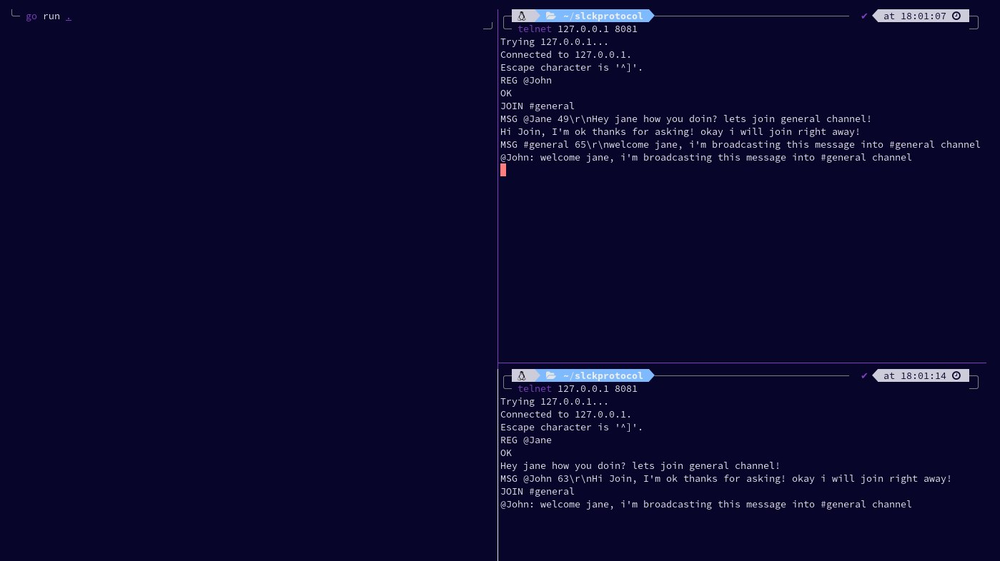

## `SLCK`



`SLCK` is a toy protocol written for the purpose of playing with bytes and tcp protocol in Go

`SLCK` has a few different commands:

| ID         | Sent by   | Description     |
| :--------- | :-------- | :-------------- |
| `REG`      | Client    | Register as client  |
| `JOIN`     | Client    | Join a channel  |
| `LEAVE`    | Client    | Leave a channel |
| `MSG`      | Both      | Send or receive a message to/from entity (channel or user) |
| `CHNS`     | Client    | List available channels |
| `USRS`     | Client    | List users |
| `OK`       | Server    | Command acknowledgement |
| `ERR`      | Server    | Error |

Let's explore each of them:

### REG

When a client connects to a server, they can register as a client using the
`REG` command. It takes an identifier as an argument, which is the client's
username.

Syntax:

```text
REG <handle>
```

where:

* `handle`: name of the user

### JOIN

When a client connects to a server, they can join a channel using the `JOIN`
command. It takes an identifier as an argument, which is the channel ID.

Syntax:

```text
JOIN <channel-id>
```

where:

* `channel-id`: ID of the channel

### LEAVE

Once a user has joined a channel, they can leave the channel using the `LEAVE`
command, with the channel ID as argument.

Syntax:

```text
LEAVE <channel-id>
```

where:

* `channel-id`: ID of the channel

**Example 1:** to leave the `#general` channel, the client can send:

```text
LEAVE #general
```

### MSG

To send a message to a channel or a user, the client can use the `MSG` command,
with the channel or user identifier as argument, followed with the body length
and the body itself.

Syntax:

```text
MSG <entity-id> <length>\r\n[payload]
```

where:

* `entity-id`: the ID of the channel or user
* `length`: payload length
* `payload`: the message body

**Example 1:** send a `Hello everyone!` message to the `#general` channel:

```text
MSG #general 16\r\nHello everyone!
```

**Example 2:** send a `Hello!` message to `@jane`:

```text
MSG @jane 4\r\nHey!
```

### CHNS

To list all available channels, the client can send the `CHNS` message. The
server will reply with the list of available channels.

Syntax:

```text
CHNS
```

### USRS

To list all users, the client can send the `USRS` message. The server will
reply with the list of available users.

Syntax:

```text
USRS
```

### OK/ERR

When the server receives a command, it can reply with `OK` or `ERR`.

`OK` does not have any text after that, think of it as an `HTTP 204`.

`ERR <error-message>` is the format of the errors returned by the server to the
client. No protocol errors result in the server closing the connection. That
means that although an `ERR` has been returned, the server is still maintaining
the connection with the client.

**Example 1:** Protocol error due to bad username selected during registration:

```
ERR Username must begin with @
```

**Example 2:** Protocol error due to bad channel ID sent with `JOIN`:

```
ERR Channel ID must begin with #
```
